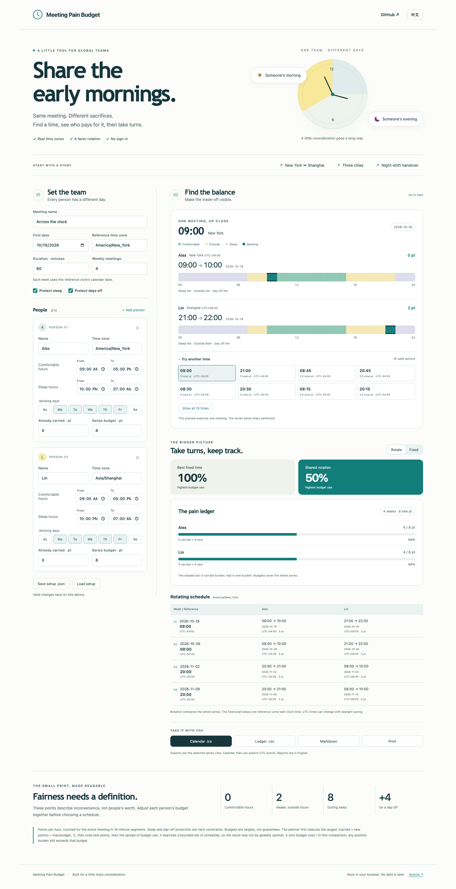

# Meeting Pain Budget

**早起晚睡，也该轮着来。** 一个在浏览器中运行的跨时区会议工具，把不便记下来，再分摊到几次会议里。

[打开网站](https://lsj0914.github.io/meeting-pain-budget/) · [English](README.md) · [计算方法](docs/methodology.md)



## 一个具体问题

纽约早上 9 点，可能是上海晚上 9 点。单次会议看起来还行，但连续几周总让同一个人晚睡，就需要换个安排。

填写每个人的时区、舒服时段、睡眠时段、工作日、历史负担和积分预算。页面会先展示一场会议，再比较整个系列的固定时间与轮换方案。

默认纽约–上海示例包含四次 60 分钟周会，跨过 2026 年 11 月的夏令时变化。两人预算均为 8 分时，最佳固定时间的最高预算使用率为 **100%**；轮换让两人各承担 **4 分**，最高使用率降到 **50%**。

## 可操作的功能

- 2–12 位参会人，1–8 次周会，真实城市时区，支持夜班和跨午夜时段。
- 展示当地开始/结束日期、UTC 偏移、全天时间带，以及睡眠、非舒服时段、非工作日的分钟数。
- 自主选择是否严格保护睡眠和非工作日。
- 通过历史负担与不同预算分摊整个系列的不便。
- 比较固定与轮换；试选单场时间不会改写系列。
- 导出日历 `.ics`、日程和账本 `.csv`、英文报告 `.md`。
- 设置可保存/导入 `.json`，有效编辑自动保存在当前浏览器。无法读取的旧草稿会保留，主动替换后才覆盖。
- 中英文界面、手机布局、键盘操作、减少动效和打印。

无需账号，没有后端、分析统计或外部字体请求。计算和草稿保存在浏览器内。

## 在本机运行

使用 Node.js 22.12+ 或 24+：

```sh
npm ci
npm run dev
```

访问 http://127.0.0.1:4174/。

```sh
npx playwright install chromium
npm run check
```

检查包含单元测试、类型检查、正式构建，以及桌面和手机尺寸下的真实浏览器操作。自动测试使用 Chromium，未覆盖 Safari/WebKit。

## 积分规则与限制

每小时：舒服时段 **0 分**、清醒但不舒服 **2 分**、睡眠 **8 分**，非工作日额外 **4 分**。按整场会议的实际经过时间，以每 15 分钟计算。时段边界和会议时长也使用 15 分钟步长。

优先降低最高的「历史 + 新增」÷ max(预算, 1)，再降低总新增积分和预算使用差距。预算是目标，并非保证。零预算在比较时按 1 作为分母，任何正积分仍会显示超预算。保护条件不会自动放宽。

轮换搜索最多保留 128 个候选状态，可能遗漏全局最优解。它会以最佳固定方案兜底，确保按同一评价规则不劣于固定方案。时区规则依赖浏览器的 `Intl` 数据。

日历包含逐场 UTC 事件，避免固定重复规则在夏令时切换后漂移。工具不会发送邀请，也不会包含参会人邮箱；下载后自行导入日历。

TypeScript + Vite + 原生 `Intl`，Vitest 与 Playwright 测试，无运行时框架依赖。MIT 许可。
